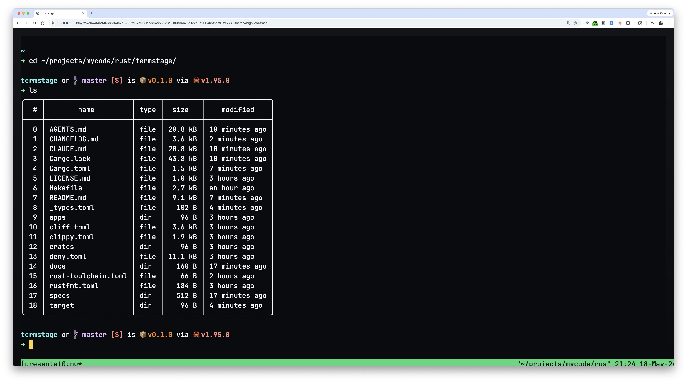

# termstage

`termstage` is a browser terminal presentation tool. It creates or attaches to a
backend-owned terminal session, starts a loopback-only Rust gateway when browser
mode is requested, and opens a tokenized browser URL. The main use case is live
demos: share a Chrome tab with large readable terminal text while keeping the
session state in tmux or rmux. Pod exposure is available only through an explicit
public mode with an operator-provided token environment variable.

> Security boundary: this is a local terminal bridge, not a sandbox. Browser input is
> sent to a real backend session with the current OS user's privileges.

Screenshot:


## What It Does

```text
Presenter
  |
  | termstage session attach TerminalUse-presentation --browser --open
  v
+----------------------+       tokenized local URL       +--------------------+
| termstage CLI       | ------------------------------> | Browser tab        |
| - validates options  |                                 | - xterm.js UI      |
| - starts gateway     | <======== WebSocket ==========> | - input + viewport |
| - serves page/API    |                                 | - theme controls   |
+----------+-----------+                                 +--------------------+
           |
           | validated backend operations
           v
+----------------------+       native attach/API       +-----------------------------+
| Session gateway      | <===========================> | tmux / rmux backend session |
| - operation lock     |                              | user's OS privileges        |
| - screen projection  |                              +-----------------------------+
+----------------------+
```

The current browser terminal mode provides:

- Loopback-only HTTP/WebSocket server by default.
- Explicit pod/public exposure mode for HTTPS ingress deployments.
- Per-start access token in the launch URL.
- Host, Origin, token, and peer-address checks.
- Browser terminal transport backed by tmux or rmux sessions.
- JSON control frames for viewport state and heartbeat.
- Backend-native attach through `termstage session attach <id>`.
- Browser/API gateway attach through `termstage session attach <id> --browser`.
- Semantic API operations for agent-style terminal control.
- Slow-client backpressure handling that closes the browser client without killing
  the terminal session.
- Vite-built, first-party frontend assets embedded into the server binary.

## Quick Start

Create a tmux-backed presentation session:

```bash
cargo run -p termstage --bin termstage -- \
  session create --backend tmux --name presentation --command k9s
```

Attach in the local terminal with the backend-native client:

```bash
cargo run -p termstage --bin termstage -- session attach TerminalUse-presentation
```

Open the same session in the browser:

```bash
cargo run -p termstage --bin termstage -- \
  session attach TerminalUse-presentation --browser --open
```

Tune readability for screen sharing:

```bash
cargo run -p termstage --bin termstage -- \
  session attach TerminalUse-presentation \
  --browser \
  --font-size 28 \
  --theme high-contrast \
  --open
```

## Important Options

| Command | Meaning |
| --- | --- |
| `session create --backend <tmux|rmux> --name <name> [--command <cmd> -g <arg>]` | Create `TerminalUse-<name>` in the selected backend. |
| `session attach <session-id>` | Native attach with `tmux attach` or `rmux attach`. |
| `session attach <session-id> --browser` | Start the browser/API gateway for an existing session. |
| `session list [--backend <backend>]` | List visible backend sessions. |
| `session inspect <session-id>` | Show backend properties and attach commands. |
| `session stop <session-id>` | Kill the resolved backend session. |

Browser-mode options for `session attach --browser`:

| Option | Default | Meaning |
| --- | --- | --- |
| `--host <addr>` | `127.0.0.1` | Bind address. Non-loopback addresses require `--expose-public`. |
| `--port <port>` | `0` | `0` lets the OS choose a free port. |
| `--open` | `false` | Open the tokenized URL in the default browser. |
| `--font-size <px>` | `24` | Browser terminal font size. |
| `--theme <name>` | `high-contrast` | Presentation theme preset. |
| `--expose-public` | `false` | Enable pod/internet mode behind HTTPS ingress. |
| `--public-url <url>` | unset | HTTPS browser-visible base URL for public mode. |
| `--token-env <name>` | unset | Environment variable containing the access token. |

## Safety Model

The browser terminal intentionally stays local-only by default.

```text
Allowed:
  127.0.0.1:<random-port> + per-start token + same-origin WebSocket

Rejected by default:
  0.0.0.0, LAN addresses, mismatched Host, mismatched Origin, bad token,
  non-loopback peer addresses
```

For pod exposure, put `termstage` behind HTTPS ingress and opt in explicitly:

```bash
TERMSTAGE_TOKEN=<64-hex-character-token> \
cargo run -p termstage --bin termstage -- \
  session attach TerminalUse-presentation \
  --browser \
  --expose-public \
  --host 0.0.0.0 \
  --port 8080 \
  --public-url https://term.example.com \
  --token-env TERMSTAGE_TOKEN
```

Public mode still controls a real backend terminal session. It validates token,
Host, and WebSocket Origin against the configured public URL, but stronger remote auth,
rate limiting, audit logging, and viewer/controller authorization remain future
hardening work.

## Documentation

- [User Guide](./docs/guides/user-guide.md): installation assumptions, CLI usage,
  demo workflow, troubleshooting, and Chinese translation.
- [Developer Guide](./docs/guides/developer-guide.md): workspace layout,
  architecture, protocol/runtime flow, quality gates, and Chinese translation.
- [Documentation Index](./docs/index.md): all project documentation.
- [Specs Index](./specs/index.md): product, protocol, runtime, web, CLI, security,
  verification, roadmap, and implementation plan.

## Development

Use the Makefile targets instead of ad hoc shell scripts:

```bash
make build
make test-cargo
make fmt
make clippy
make clippy-boundary
make frontend-ci
make ci
```

`make ci` is the full local gate. It runs Rust build/test/fmt/clippy/doc/audit/deny
and frontend install/typecheck/build/Playwright tests.

## 中文

`termstage` 是给现场演示用的浏览器终端。它先创建或接入一个由后端拥有的终端
session；当使用浏览器模式时，会在本机启动只监听 loopback 的 Rust gateway，生成带
访问令牌的本地 URL。实际会话状态保存在 tmux 或 rmux 中；pod 公网暴露必须显式启用
public mode，并从环境变量读取访问 token。

最常见的用法是：演讲时只共享 Chrome 标签页，让观众看到字号更大、对比度更高的
终端；如果浏览器刷新或短暂断开，演示会话还能接回来，不至于丢掉刚才的状态。

> 需要先说清楚：这是本地终端桥接工具，不是沙箱。你在浏览器里输入的内容，会
> 以当前操作系统用户的权限进入真实后端 session。

截图:


### 它怎么工作

```text
演讲者
  |
  | termstage session attach TerminalUse-presentation --browser --open
  v
+----------------------+       带令牌的本地 URL         +--------------------+
| termstage CLI        | ---------------------------> | 浏览器标签页       |
| - 检查参数            |                               | - xterm.js 界面    |
| - 启动 gateway        | <====== WebSocket =========> | - 输入和视口状态   |
| - 提供页面/API        |                              | - 主题控制         |
+----------+-----------+                              +--------------------+
           |
           | 已校验的后端操作
           v
+----------------------+       native attach/API       +-----------------------------+
| Session gateway      | <===========================> | tmux / rmux 后端 session    |
| - 操作锁             |                              | 当前系统用户权限            |
| - 屏幕投影           |                              +-----------------------------+
+----------------------+
```

目前已经具备这些能力：

- HTTP 和 WebSocket 服务默认只监听本机 loopback 地址。
- 每次启动都会生成新的访问令牌，令牌只出现在启动 URL 中。
- 服务端会检查 Host、Origin、token 和 peer 地址。
- 浏览器终端接入 tmux 或 rmux 后端 session。
- 视口状态和 heartbeat 使用 JSON 控制帧。
- 本地终端通过 `termstage session attach <id>` 走后端 native attach。
- 浏览器和 API gateway 通过 `termstage session attach <id> --browser` 接入。
- 提供给 agent 使用的语义 API 操作。
- 如果浏览器跟不上大量输出，会关闭这个慢客户端，但不会杀掉底层终端会话。
- 前端资源由 Vite 构建，并作为一方资源嵌进服务端二进制，不依赖 CDN。

### 快速开始

创建一个 tmux 演示会话：

```bash
cargo run -p termstage --bin termstage -- \
  session create --backend tmux --name presentation --command k9s
```

在本地终端用后端 native client attach：

```bash
cargo run -p termstage --bin termstage -- session attach TerminalUse-presentation
```

把同一个 session 打开到浏览器：

```bash
cargo run -p termstage --bin termstage -- \
  session attach TerminalUse-presentation --browser --open
```

演示时可以把字体调大一些：

```bash
cargo run -p termstage --bin termstage -- \
  session attach TerminalUse-presentation \
  --browser \
  --font-size 28 \
  --theme high-contrast \
  --open
```

### 安全边界

浏览器终端默认只面向本机使用。

```text
允许的形态：
  127.0.0.1:<随机端口> + 每次启动的 token + 同源 WebSocket

默认会被拒绝的形态：
  0.0.0.0、局域网地址、Host 不匹配、Origin 不匹配、token 错误、
  非 loopback peer 地址
```

如果要放进 pod 并通过 HTTPS ingress 暴露，必须显式启用 public mode，并从环境
变量读取高熵 token：

```bash
TERMSTAGE_TOKEN=<64 位 hex token> \
cargo run -p termstage --bin termstage -- \
  session attach TerminalUse-presentation \
  --browser \
  --expose-public \
  --host 0.0.0.0 \
  --port 8080 \
  --public-url https://term.example.com \
  --token-env TERMSTAGE_TOKEN
```

public mode 仍然是在控制真实后端终端 session。它会按配置的 public URL 校验
token、Host 和 WebSocket Origin；更强的远程认证、限流、审计日志和观看者/控制者
授权仍属于后续加固工作。

### 文档

- [用户指南](./docs/guides/user-guide.md)：运行环境、CLI 用法、演示流程、刷新重连、故障排查。
- [开发者指南](./docs/guides/developer-guide.md)：工作区结构、架构、协议和运行时流程、质量门禁。
- [文档索引](./docs/index.md)：项目文档入口。
- [规格索引](./specs/index.md)：产品、协议、运行时、Web、CLI、安全、验证、路线图和实现计划。

## License

This project is distributed under the terms of MIT.

See [LICENSE](LICENSE.md) for details.

Copyright 2025 Tyr Chen
