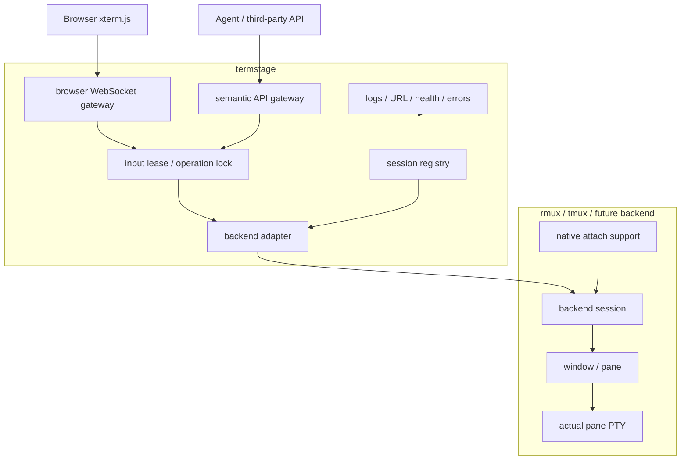
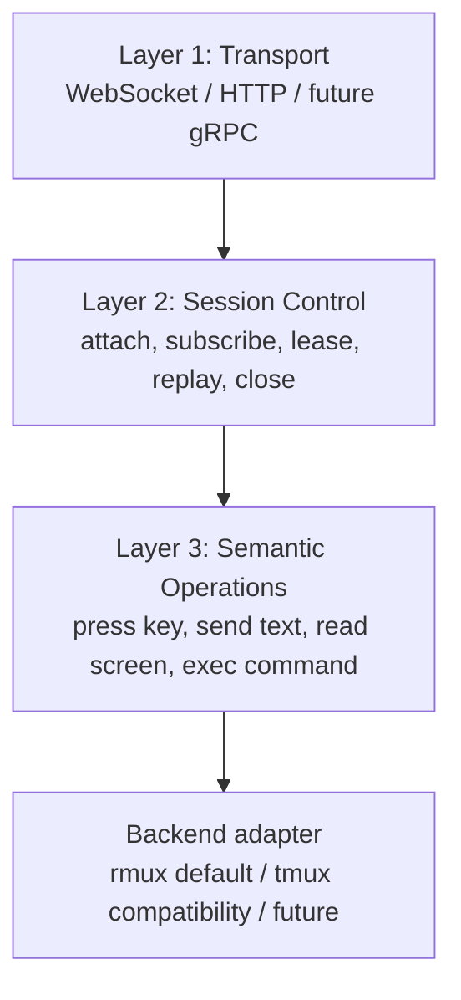
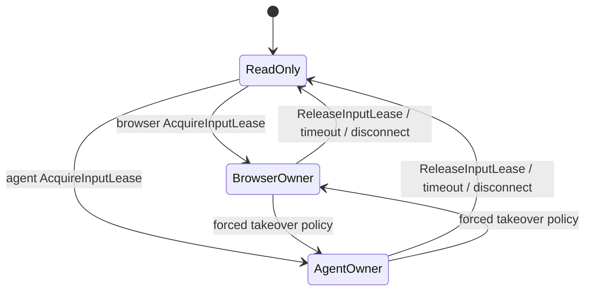

# Session Gateway and Operation Lease Design

Status: redesign draft v4
Last updated: 2026-05-27

## 1. Problem

The previous shell-mode design modeled sharing as `termstage` owning a command
PTY and optionally rendering that PTY back into the invoking terminal. That mixes
two concerns:

- `termstage` as the user-facing command entrypoint, browser gateway, API
  gateway, and session manager;
- the terminal multiplexer or PTY backend that owns the actual session, panes,
  screen state, and native attach behavior.

The revised design makes this separation explicit. `termstage` manages sessions,
browser WebSocket traffic, semantic API traffic, and operation lease state. The
actual terminal session is owned by a backend such as `rmux` by default, `tmux`
as a compatibility backend, or a future backend. `termstage`'s own stdout/stderr
remain a supervisor surface for logs, URLs, status, health, and errors. Command
output must not be rendered into the `termstage` supervisor terminal.

## 2. Goals

| # | Goal | Measure |
| --- | --- | --- |
| G1 | Define `termstage session` as a backend session reference. | A termstage session id maps to backend, backend session id, window id, and pane id. |
| G2 | Make `rmux` the preferred/default session backend. | Browser/API control uses rmux session/pane APIs rather than a termstage-owned command PTY. |
| G3 | Keep browser traffic under termstage management. | Browser xterm.js input/output flows through termstage WebSocket and is translated to backend operations/events. |
| G4 | Add semantic operations for third-party automation. | Agent/API clients can press keys, send text, read screen snapshots, wait for text, and execute command-style request/response operations. |
| G5 | Enforce Level 1 operation lease in termstage. | Browser and API writes must acquire the termstage-managed lease; non-owners remain read-only. |
| G6 | Preserve native backend attach. | A user can attach to the same backend session directly, e.g. `rmux attach -t <session>`, and see the same screen. |
| G7 | Remove local terminal attach/split-TUI behavior. | The invoking terminal prints termstage supervisor output only. |

## 3. Non-goals

- This spec does not require `termstage` to own the shared command PTY.
- This spec does not require `termstage` to render a local command terminal pane.
- This spec does not make `xterm.js` directly attach to a PTY or multiplexer
  socket. Browser traffic still goes through `termstage`.
- This spec does not require Level 2 backend-enforced locking in the first
  implementation. Direct native attach clients may still write unless the
  backend supports read-only attach or server-side locks.
- This spec does not split the embedded web server into a standalone process.

## 4. Recommended Model



The binding concept is:

```text
termstage session "abc"
  -> backend: rmux
  -> backend session: "abc"
  -> target window/pane: main
```

Native terminal users attach through the backend:

```bash
rmux attach -t abc
```

Browser users attach through `termstage`:

```text
browser -> termstage WebSocket -> rmux API/session -> same backend pane
```

API users operate through `termstage` semantic operations:

```text
agent -> termstage API -> rmux API/session -> same backend pane
```

All three observe the same backend-owned session. `termstage` is the gateway and
lease authority for clients that connect through `termstage`; the backend remains
the owner of session/pane/PTY state.

## 5. Three-Layer Protocol

The protocol is layered so terminal rendering, session lifecycle, and automation
do not collapse into one raw byte stream.



### 5.1 Transport Layer

Transport is only the carrier. Initial transports:

- Browser WebSocket for interactive UI updates and input.
- HTTP or WebSocket API for agent/third-party semantic operations.
- Future gRPC/QUIC/TCP transports may carry the same protocol messages.

Transport must validate token, Host, Origin, peer, body/frame size, and rate
limits before protocol messages enter the session layer.

### 5.2 Session Control Layer

Session control manages who is connected, what backend session they target, and
who is allowed to write.

Core messages:

| Message | Direction | Meaning |
| --- | --- | --- |
| `CreateSession` | client -> termstage | Create or ensure a backend session reference. |
| `AttachSession` | client -> termstage | Attach browser/API stream to a termstage session. |
| `DetachSession` | client -> termstage | Detach one client. |
| `ListSessions` | client -> termstage | List known termstage/backend session mappings. |
| `ListPanes` | client -> termstage | Return backend windows/panes for a session. |
| `SubscribeScreen` | client -> termstage | Subscribe to screen updates for a pane. |
| `AcquireInputLease` | client -> termstage | Request write ownership for browser/API operations. |
| `ReleaseInputLease` | client -> termstage | Release write ownership. |
| `LeaseChanged` | termstage -> clients | Broadcast current lease owner and epoch. |
| `ReplayStarted` / `ReplayFinished` | termstage -> client | Bound replay/snapshot delivery. |
| `CloseSession` | client -> termstage | Close termstage session mapping and optionally backend session. |
| `Heartbeat` | both | Keep connection liveness. |

### 5.3 Semantic Operations Layer

Semantic operations are backend-neutral. The rmux adapter should map them to
rmux SDK/API calls directly where possible. tmux and future adapters translate
the same operations to their own commands/APIs.

Interactive operations:

| Operation | Meaning |
| --- | --- |
| `PressKey { pane_id, key, modifiers }` | Press one logical key such as `h`, `Enter`, `Ctrl-C`, or `PageDown`. |
| `SendText { pane_id, text }` | Send text without implicit newline. |
| `PasteText { pane_id, text }` | Send bracketed paste when backend supports it; otherwise send safe text input. |
| `MouseEvent { pane_id, x, y, action }` | Send click, drag, or wheel when backend supports mouse input. |
| `ScrollViewport { pane_id, direction, lines }` | Move the browser/API view over captured scrollback without changing app state. |
| `ReadScreen { pane_id, format }` | Return a structured screen snapshot. |
| `WaitForText { pane_id, pattern, timeout }` | Resolve when the rendered screen/scrollback contains text. |
| `WaitForScreenChange { pane_id, timeout }` | Resolve when the screen changes. |

Request/response command operations:

| Operation | Meaning |
| --- | --- |
| `ExecCommand { pane_id, command, timeout }` | Execute a shell-like command and return one result. |
| `ExecResult { request_id, status, output, exit_code }` | Result for `ExecCommand`. |
| `CancelExec { request_id }` | Cancel a pending command request when backend supports cancellation. |

`ExecCommand` is only valid for shell-like panes. It is not a substitute for
interacting with full-screen TUIs such as editors, dashboards, Claude Code, k9s,
or Zellij/rmux UI surfaces.

## 6. Screen Model

`ReadScreen` and `SubscribeScreen` should return structured screen state rather
than an opaque text blob.

```json
{
  "type": "screenSnapshot",
  "sessionId": "abc",
  "paneId": "main",
  "size": { "cols": 120, "rows": 40 },
  "cursor": { "row": 12, "col": 4 },
  "alternateScreen": true,
  "title": "k9s",
  "rows": [
    { "text": "Pods", "attrs": [] }
  ]
}
```

The snapshot model should preserve enough terminal semantics for browser
rendering and agent reasoning:

- text cells;
- cursor position;
- colors/styles when available;
- alternate-screen state when available;
- title when available;
- scrollback/window viewport boundaries when available.

The rmux backend is preferred because it already exposes session/window/pane
handles, snapshots, send text/keys, wait primitives, and event subscriptions in
the direction this protocol needs.

## 7. Raw Terminal Stream Compatibility

The three-layer protocol does not remove raw terminal semantics. Backends and
browser renderers must still account for the underlying VT/ANSI terminal model:

```text
VT/ANSI byte stream
  text
  cursor movement
  colors / styles
  alternate screen
  scroll regions
  mouse protocol
  terminal queries/responses
  title / hyperlink / clipboard OSC
```

In the rmux-first design, termstage should prefer structured screen snapshots
and semantic input operations over owning a raw PTY. For compatibility backends
or fallback flows, raw bytes can still be carried as an implementation detail,
but raw byte ownership is not the default termstage session model.

## 8. Operation Lease

`termstage` is the Level 1 lease authority for clients that connect through
termstage.



Level 1 rules:

- Browser and API write operations must include or resolve to a lease owner.
- If a client does not own the lease, `PressKey`, `SendText`, `PasteText`,
  `MouseEvent`, and `ExecCommand` are rejected or queued according to explicit
  policy.
- Read operations such as `ReadScreen`, `SubscribeScreen`, `ListPanes`, and
  `WaitForText` remain available to non-owners.
- Lease changes are broadcast to browser/API clients as `LeaseChanged`.
- Lease state is in-memory for the first implementation.
- Lease timeout and disconnect release ownership.

Level 1 limitation:

- A user who directly runs `rmux attach -t abc` may still type into the backend
  session outside termstage's control. Level 1 only constrains clients whose
  writes pass through termstage.

Level 2 TODO:

- Backend-enforced locks/read-only native attach should be designed later.
- The backend should enforce that only the termstage lease owner can mutate the
  pane, including native attached clients.
- This depends on rmux or another backend exposing server-side client write
  control, read-only attach, or a lock API.

## 9. Backend Translation

### 9.1 rmux Backend

rmux is the recommended default because its direction matches the desired
semantic layer:

- session/window/pane handles;
- screen snapshots;
- send text / send keys;
- wait for text/output;
- pane event subscription;
- native attach support.

Expected mappings:

| Termstage operation | rmux mapping |
| --- | --- |
| `CreateSession` / `AttachSession` | connect or start daemon, ensure session exists. |
| `ListPanes` | rmux session/window/pane listing. |
| `SubscribeScreen` | rmux pane event subscription. |
| `ReadScreen` | rmux pane snapshot. |
| `PressKey` | rmux pane key action. |
| `SendText` / `PasteText` | rmux pane text input. |
| `WaitForText` | rmux wait primitive. |
| `ExecCommand` | marker-based shell command wrapper, or rmux native exec if it grows one. |

### 9.2 tmux Compatibility Backend

tmux can remain as a compatibility backend, but it has weaker semantic APIs:

| Termstage operation | tmux mapping |
| --- | --- |
| `CreateSession` / `AttachSession` | `tmux new-session` / `tmux attach-session` semantics. |
| `ListPanes` | `tmux list-panes`. |
| `ReadScreen` | `tmux capture-pane`. |
| `PressKey` / `SendText` | `tmux send-keys`. |
| `SubscribeScreen` | polling `capture-pane`, or fallback raw attach mode. |
| `ExecCommand` | marker + `send-keys` + `capture-pane` parsing. |

### 9.3 Plain PTY Fallback

A plain PTY backend may remain for simple local-only demos, but it is no longer
the default shared-session model. It cannot provide native attach unless
termstage implements its own mux/server or launches an external multiplexer.

## 10. Implementation Phases

### Phase 1 - Remove Local Terminal Attach

Goal: delete the old attach-local-terminal/local split TUI direction so the code
and docs stop implying that termstage should render the command PTY locally.

Tasks:

1. Remove `--attach-local-terminal` and any replacement local terminal attach
   flag from the CLI surface.
2. Remove local terminal frontend code that places the invoking terminal in raw
   mode or alternate screen.
3. Ensure termstage stdout/stderr stay supervisor-only: logs, URL, health,
   status, and errors.
4. Keep existing browser terminal behavior working through the current runtime
   until Phase 2 replaces the backend model.
5. Update README/docs/spec references away from local terminal attach.

Exit criteria:

- No CLI flag attaches or renders the command PTY in the invoking terminal.
- `termstage` terminal output is supervisor-only.
- Existing browser mode still starts and accepts browser input.
- Tests cover removal/rejection of the old local attach flag.

### Phase 2 - Implement Session Gateway Architecture

Goal: introduce backend session management and semantic operations with rmux as
the preferred default backend.

Tasks:

1. Add a session registry that maps termstage session ids to backend session
   references.
2. Add a backend adapter trait for session control and semantic operations.
3. Implement rmux backend adapter first.
4. Add browser WebSocket gateway that subscribes to backend screen events and
   sends browser input through termstage semantic operations.
5. Add semantic API endpoints for `ReadScreen`, `PressKey`, `SendText`,
   `PasteText`, `WaitForText`, and `ExecCommand`.
6. Add Level 1 lease enforcement across browser/API write operations.
7. Add tmux compatibility adapter after rmux basics are stable.

Exit criteria:

- `termstage` can create/attach a rmux-backed session.
- `rmux attach -t <session>` and browser view observe the same backend session.
- Browser input goes through termstage and mutates the rmux session.
- API `PressKey`/`SendText` mutations are reflected in browser and native rmux
  attach views.
- Non-owner browser/API writes are rejected while another termstage client owns
  the lease.
- `ReadScreen` and `ExecCommand` have request/response tests.

## 11. Verification Plan

- CLI tests:
  - old local attach flag is rejected or absent;
  - session/backend flags validate into a backend session reference.
- Session registry tests:
  - create, attach, detach, list sessions;
  - reject invalid session ids and backend ids.
- Lease tests:
  - browser acquires lease and API write is rejected;
  - API acquires lease and browser write is rejected;
  - disconnect/timeout releases lease.
- rmux backend tests:
  - create/ensure session;
  - send text/key to pane;
  - read screen snapshot;
  - wait for text;
  - subscribe screen change.
- Browser/API integration tests:
  - browser input mutates backend and screen update returns to browser;
  - API `SendText` mutates backend and update returns to browser;
  - `ExecCommand` returns command output and exit status for shell-like pane.

## 12. Cross-references

- Depends on [10-browser-terminal-protocol-design.md](./10-browser-terminal-protocol-design.md)
  for existing WebSocket control conventions that will be replaced or extended.
- Depends on [20-browser-terminal-web-design.md](./20-browser-terminal-web-design.md)
  for browser gateway routing.
- Extends [50-browser-terminal-cli-design.md](./50-browser-terminal-cli-design.md)
  with backend session defaults and removal of local attach flags.
- Extends [70-browser-terminal-security-design.md](./70-browser-terminal-security-design.md)
  with API write authorization and lease enforcement.
- Should update [90-browser-terminal-roadmap.md](./90-browser-terminal-roadmap.md)
  and [91-browser-terminal-impl-plan.md](./91-browser-terminal-impl-plan.md)
  after this design is accepted.
