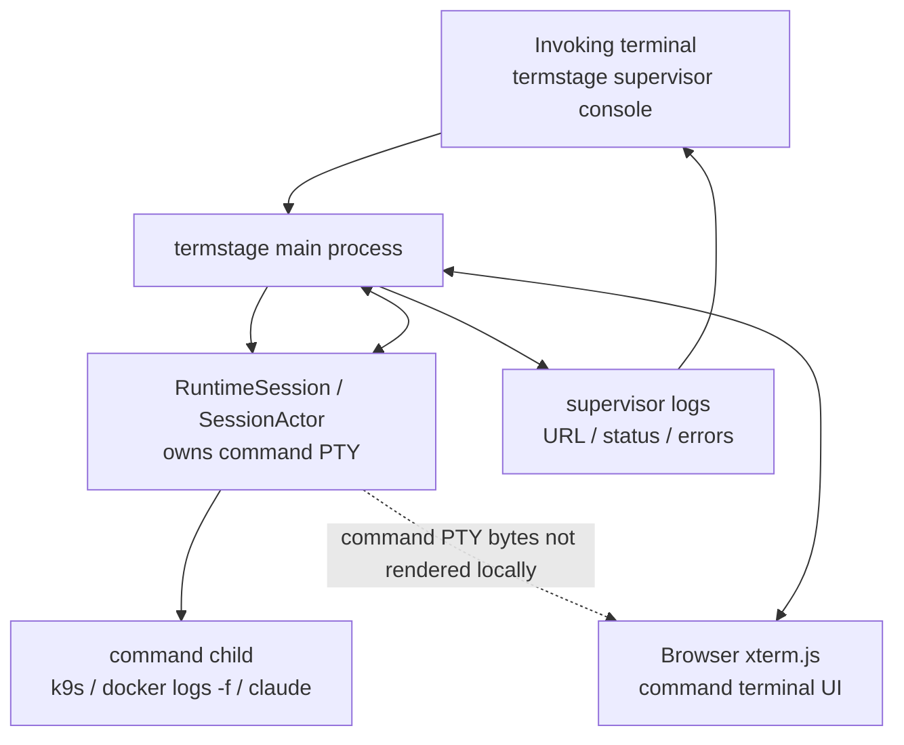
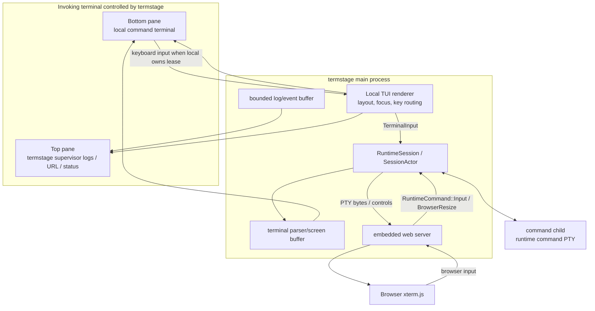
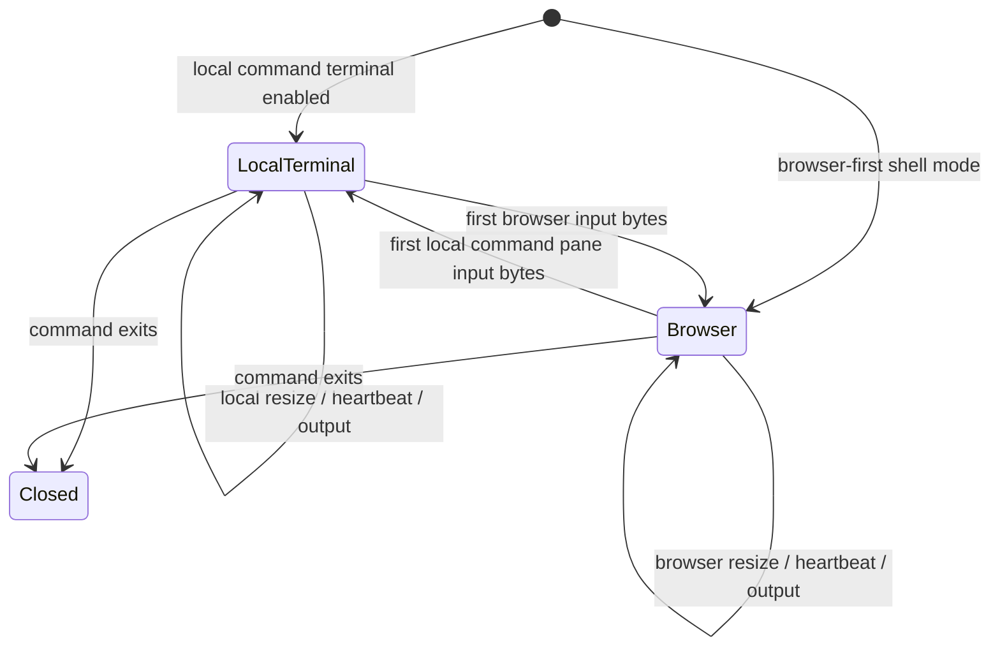
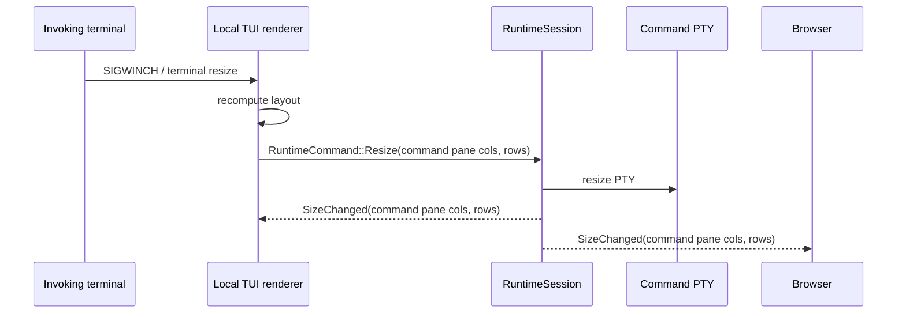

# Shell Mode Command Terminal Split Design

Status: redesign draft v3
Last updated: 2026-05-27

## 1. Problem

Shell mode runs a configured command inside a runtime-owned PTY. Without local
terminal participation, the invoking terminal is only the `termstage` supervisor
console: it can show startup logs, errors, and the browser URL, but it does not
show or control the command's PTY. This is correct for browser-first operation,
but it is surprising for commands such as `docker logs -f`, `k9s`, or `claude`
when the operator expects to see the command in the terminal where `termstage`
was launched.

The previous working name `--attach-local-terminal` describes an implementation
detail, not the user-visible behavior. The feature is better described as
showing and controlling the command terminal inside the local terminal. When this
capability is enabled, `termstage` must also separate its own supervisor output
from command PTY output so logs do not corrupt interactive terminal rendering.

## 2. Goals

| # | Goal | Measure |
| --- | --- | --- |
| G1 | Make the feature name describe the visible behavior. | CLI help says the flag opens a local command terminal pane, not that it "attaches" an implementation detail. |
| G2 | Preserve browser-first shell mode by default. | Without the flag, local terminal output contains supervisor logs/URL only; command PTY bytes are visible in the browser. |
| G3 | Split local display when enabled. | With the flag, the local terminal renders a `termstage` supervisor pane and a separate command terminal pane. |
| G4 | Preserve PTY semantics for the command. | `docker logs -f`, `k9s`, shells, and TUIs still run in the runtime command PTY, not through piped stdin/stdout. |
| G5 | Keep browser and local command panes synchronized. | Browser xterm.js and the local command terminal pane observe the same command PTY output and can transfer input ownership through the lease model. |
| G6 | Prevent log/output corruption. | `termstage` logs never write directly into the command terminal pane while local command terminal mode is active. |

## 3. Naming

Candidate CLI names:

| Candidate | Example | Pros | Cons |
| --- | --- | --- | --- |
| `--local-command-terminal` | `termstage --mode shell --command k9s --local-command-terminal` | Most explicit: local terminal displays and controls the command terminal. Avoids implying the command owns `termstage` stdout directly. | Longer than the old flag. |
| `--command-terminal` | `termstage --mode shell --command k9s --command-terminal` | Shorter, focused on the command pane. | Less explicit that it affects the local invoking terminal. |
| `--local-command-io` | `termstage --mode shell --command k9s --local-command-io` | Precisely says command input/output is connected locally. | More technical and less user-facing than "terminal". |

Decision: use `--local-command-terminal` as the binding long flag for this
redesign. It supersedes the working name `--attach-local-terminal` in specs and
future help text. The short flag remains available for design discussion as
`-a`, but the long name should carry the meaning in docs and examples.

## 4. Non-goals

- This does not make the command inherit `termstage`'s ordinary stdout/stderr.
  The command still runs in the runtime-owned command PTY.
- This does not implement a second command process. Browser and local command
  terminal views observe one command PTY.
- This does not add multi-viewer read-only authorization. Existing token, Host,
  Origin, and peer checks still define browser access.
- This does not persist a lease across process restarts. Runtime owns lease state
  in memory.
- This does not split the embedded web server into a separate process.

## 5. Default Shell Mode

Without `--local-command-terminal`, shell mode remains browser-first:

Behavior:

- The command starts in a PTY owned by `RuntimeSession`.
- Local terminal does not display command PTY bytes.
- Local terminal can safely show `termstage` startup status, tokenized launch
  URL, and non-sensitive logs.
- Browser remains the command terminal UI.

## 6. Local Command Terminal Mode

With `--local-command-terminal`, the invoking terminal becomes a full-screen
local UI owned by `termstage`. It must not directly print logs to stdout/stderr
after entering raw/full-screen mode. Instead, `termstage` routes supervisor logs
to a log pane and command PTY rendering to a separate command pane.

Important distinction:

- `termstage`'s own supervisor console and the command terminal are separate
  panes rendered into the same invoking terminal.
- The command does not write to `termstage` stdout/stderr.
- `termstage` reads command PTY bytes, updates a terminal screen buffer, and
  redraws the command pane.
- Logs go through `tracing`/event channels into the log pane or an optional log
  file. They never interleave with raw command PTY bytes.

## 7. Rendering Strategy

The local UI needs two responsibilities:

1. Draw `termstage` UI panes and status/log content.
2. Render the command PTY byte stream inside a pane.

Ratatui is suitable for the pane layout and full-screen TUI shell. It is not, by
itself, a terminal emulator for arbitrary child-process output. The command pane
therefore needs a terminal parser/screen buffer such as `vt100`, or a Ratatui
terminal widget such as `tui-term` if it proves mature enough for the required
semantics.

Current ecosystem check:

- `ratatui` latest docs show version `0.30.0`; use it as the candidate TUI
  layout/rendering crate. It is a TUI library, not a terminal emulator.
- `vt100` latest docs show version `0.16.2`; it parses a terminal byte stream
  and provides an in-memory rendered screen.
- `tui-term` provides a pseudoterminal widget for Ratatui. Treat it as a
  candidate integration layer, not a hard dependency until implementation
  validates compatibility with `k9s`, shells, and Claude-style TUIs.

Implementation may choose:

| Option | Shape | Use when |
| --- | --- | --- |
| Ratatui + `vt100` | Own layout and render parsed screen cells manually or through a small adapter. | Maximum control, fewer widget assumptions. |
| Ratatui + `tui-term` | Use existing pseudoterminal widget around a parser screen. | Widget behavior handles enough terminal features and passes smoke tests. |
| Fallback passthrough | Preserve current raw local terminal attach behavior behind a development flag only. | Needed temporarily while the split TUI is incomplete; not the final design. |

## 8. Lease State Machine

The runtime remains the only authority for input ownership. UI panes can display
readonly state, but only runtime state decides whether input bytes are written to
the command PTY.

Events:

- Local command pane input transfers ownership to local terminal if the current
  owner is browser, then writes bytes to the command PTY.
- Browser input transfers ownership to browser if the current owner is local
  terminal, then writes bytes to the command PTY.
- Resize, heartbeat, reconnect, and attach are not ownership events.
- Browser attach receives current `LeaseChanged(owner, epoch)` and replay.
- Command exit closes browser and local command terminal clients according to
  exit policy.

## 9. Resize Semantics

In split TUI mode, the command PTY size must match the command pane, not the full
invoking terminal size.

Browser resize remains independent. The runtime lease/resize policy decides
which frontend's size is authoritative at a given time. When local terminal owns
the lease, local command pane dimensions should be preferred; when browser owns
the lease, browser dimensions should be preferred.

## 10. Logging and Output Rules

- Before entering local TUI mode, `termstage` may print startup diagnostics and
  launch URL using existing conventions.
- After entering local TUI mode, `termstage` must not write ordinary logs to the
  command pane or raw stdout/stderr.
- Logs are sent to a bounded log/event channel consumed by the local TUI log
  pane.
- If the log pane overflows, it drops oldest entries or uses a bounded ring
  buffer. It must not block command PTY output.
- Sensitive data rules from
  [70-browser-terminal-security-design.md](./70-browser-terminal-security-design.md)
  still apply: tokens, terminal bytes, and secrets are never logged.

## 11. Implementation Notes

- Follow `AGENTS.md` for Rust 2024, no unsafe, no production `unwrap()`/`expect()`,
  structured errors, actor-owned mutable state, strict protocol validation, and
  bounded channels.
- Add a local TUI actor in `apps/server`; do not duplicate PTY ownership outside
  `RuntimeSession`.
- The local TUI actor owns raw mode, alternate-screen entry/exit, panic-safe
  terminal restoration, layout, and keyboard focus routing.
- The runtime actor still owns command PTY lifecycle, replay, lease state, and
  shutdown.
- Prefer message passing between runtime, local TUI, and log/event producer.
- Do not use ordinary `Command::stdin(Stdio::piped())` for the child. The child
  continues to spawn through `portable-pty`.

## 12. Verification Plan

- CLI parser tests:
  - accepts `--local-command-terminal` only with `--mode shell`;
  - rejects it outside shell mode;
  - documents or rejects the old `--attach-local-terminal` name according to the
    final compatibility decision.
- Local TUI unit tests:
  - command pane size calculation excludes log pane height;
  - log ring buffer is bounded;
  - keyboard focus routes ordinary input to command pane by default.
- Runtime integration tests:
  - local command pane input emits `RuntimeCommand::TerminalInput`;
  - browser input transfers lease to browser;
  - local pane input transfers lease back to local terminal;
  - command exit restores terminal mode and shuts down per exit policy.
- E2E smoke tests:
  - `docker logs -f` style continuous output does not corrupt log pane;
  - `k9s` or a TUI fixture runs in the command pane;
  - browser and local command pane see the same command output.

## 13. Cross-references

- Depends on [10-browser-terminal-protocol-design.md](./10-browser-terminal-protocol-design.md)
  for WebSocket control frame conventions.
- Depends on [11-browser-terminal-runtime-design.md](./11-browser-terminal-runtime-design.md)
  for actor ownership and PTY lifecycle.
- Extends [50-browser-terminal-cli-design.md](./50-browser-terminal-cli-design.md)
  with shell-mode local command terminal naming and behavior.
- Extends [70-browser-terminal-security-design.md](./70-browser-terminal-security-design.md)
  without changing the trust boundary.
